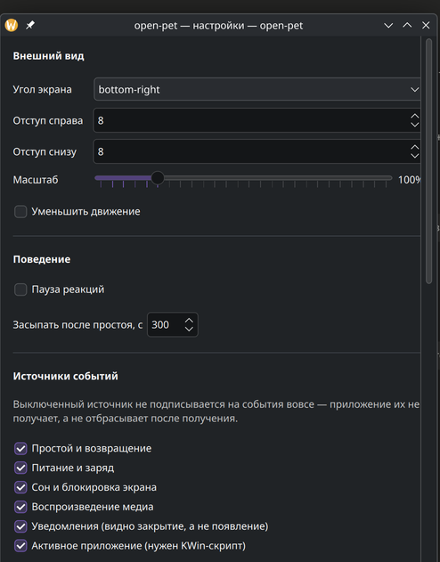

# open-pet

Desktop AI Pet — постоянно доступный анимированный питомец поверх рабочего стола.
Эталонная среда: **KDE Plasma 6.2+ / Wayland**.

Питомец реагирует на обезличенные признаки активности и системные события, меняет
эмоцию и анимацию, показывает короткие реплики. Работает полностью локально;
LLM — опциональное дополнение, включаемое явно.

> **Статус:** M7. Питомец реагирует на события системы, показывает реплики
> из шаблонов или подключённой LLM, импортирует Pet Pack и настраивается
> из окна. Остались автозапуск, диагностика и упаковка.

<table>
<tr>
<td width="42%" valign="top">


</td>
<td valign="top">



</td>
</tr>
<tr>
<td align="center"><sub>Лайм рядом с панелью: реплика на смену контекста</sub></td>
<td align="center"><sub>Настройки: переключатель на каждый источник событий</sub></td>
</tr>
</table>

## Источник истины

Разработка ведётся по спецификации и roadmap MVP:

→ [`docs/desktop-ai-pet-mvp-spec-roadmap.md`](docs/desktop-ai-pet-mvp-spec-roadmap.md) (Draft v0.3)

Документ фиксирует продуктовые границы, privacy-модель, архитектуру, функциональные
требования, Definition of Done и этапы M0–M7. Принятие зафиксировано в
[ADR-000](docs/adr/0000-adopt-mvp-roadmap.md). Отклонения от него оформляются
новым ADR — см. [docs/adr/](docs/adr/README.md).

## Карта документации

| Документ | Назначение |
|---|---|
| [`docs/desktop-ai-pet-mvp-spec-roadmap.md`](docs/desktop-ai-pet-mvp-spec-roadmap.md) | Спецификация и roadmap MVP. Источник истины |
| [`docs/privacy-model.md`](docs/privacy-model.md) | Что наблюдается, что нет, что хранится, что уходит в LLM |
| [`docs/reference-system.md`](docs/reference-system.md) | Эталонная система, методика замеров и отклонения от §7 |
| [`docs/adr/`](docs/adr/README.md) | Принятые архитектурные решения и их процесс |
| [`docs/backlog.md`](docs/backlog.md) | Замеченное, но не запланированное |
| [`spikes/`](spikes/README.md) | Пробы этапа M0 и их результаты |
| [`AGENTS.md`](AGENTS.md) | Правила работы в репозитории для людей и агентов |

## Что делает MVP

- Прозрачный overlay без рамки и записи в панели задач, у выбранного края экрана.
- Восемь состояний: `idle`, `happy`, `curious`, `sleepy`, `charging`, `low_battery`,
  `notification`, `busy`.
- Локальный rule engine с приоритетами, cooldown и защитой от спама.
- Шаблонные реплики `ru`/`en`; LLM (Ollama, OpenAI-compatible, Vertex AI) — опционально,
  с обязательным fallback на шаблон.
- Импорт и валидация Pet Pack v1 — данные, без исполняемого кода.

Границы MVP — §4 спецификации. Всё, что не входит, перечислено явно в §4.3.

## Privacy в двух строках

Приложение видит **факт** активности, смены приложения, уведомления и воспроизведения
медиа. Оно не читает клавиши, текст, заголовки окон, содержимое уведомлений, экран,
буфер обмена и аудио. Сеть не используется, пока пользователь явно не включит LLM.
Подробности — [`docs/privacy-model.md`](docs/privacy-model.md).

## Архитектура

```text
QML UI (ui/qml)
  ↓ PetViewModel
Qt/KDE Desktop Host (apps/desktop-kde)
  ├─ LayerShellQt, tray, input region  (platform/kde-wayland)
  ├─ KIdleTime, UPower, login1         (platform/kde-wayland)
  └─ CoreBridge — узкий C ABI          (platform/contracts)
          ↓ нормализованные DTO
Rust Core (core)
  ├─ state machine, приоритеты, cooldown
  ├─ каталог реплик, история, локали ru/en
  ├─ Pet Pack: разбор, проверка, распаковка, откат
  └─ LLM: политика, формат запроса, разбор ответа
```

Платформенные детали живут только в адаптерах; через границу host↔core ходят
стабильные POD-структуры, не Qt-типы. Правила границы — [ADR-001](docs/adr/0001-rust-qt-bridge.md).

## Структура репозитория

```text
apps/desktop-kde/          # entry point, tray, packaging
ui/qml/                    # общий QML UI
core/                      # Rust domain core
platform/contracts/        # C ABI между хостом и ядром
platform/kde-wayland/      # LayerShellQt, input region
assets/builtin-pet/        # встроенный питомец Лайм
pet-pack/schema/           # JSON Schema манифеста Pet Pack v1
spikes/                    # пробы M0
docs/                      # спецификация, privacy model, ADR
```

Каталог `tests/fixtures/` появится вместе с импортом пакетов.

## Встроенный питомец

Лайм — пиксельный зелёный лис в тёмном худи. Спрайтовый лист 8×11, ячейка
192×208, все восемь состояний §4.1 отрисовываются из одной текстуры.
Раскладка строк и её слабые места — в
[`assets/builtin-pet/README.md`](assets/builtin-pet/README.md).

Спрайтовый лист и стал контрактом Pet Pack v1: §FR-8 переписан по
[ADR-005](docs/adr/0005-pet-pack-sprite-sheet.md). Встроенный питомец
проходит собственный валидатор — 49% объявленных ячеек при пороге 40%
и текстура 13 МиБ при пределе 16.

## Сборка

Нужны Qt 6.5+, LayerShellQt, Rust и CMake. Точные версии эталонной системы —
в [`docs/reference-system.md`](docs/reference-system.md).

```bash
cmake -S . -B build -G Ninja -DCMAKE_BUILD_TYPE=RelWithDebInfo && cmake --build build
```

Запуск:

```bash
./build/apps/desktop-kde/open-pet
```

Тесты домена не требуют ни Qt, ни Wayland, ни дисплея:

```bash
cargo test --manifest-path core/Cargo.toml
```

### Диагностика

Логи Qt на Plasma по умолчанию уходят в journald. Чтобы увидеть их в терминале:

```bash
QT_FORCE_STDERR_LOGGING=1 QT_LOGGING_RULES='openpet.*=true' ./build/apps/desktop-kde/open-pet
```

| Переменная | Действие |
|---|---|
| `OPENPET_NO_REGION` | не задавать input region: окно ловит ввод целиком |
| `OPENPET_NO_TRAY` | не показывать значок в трее |
| `OPENPET_IDLE_SECONDS` | порог простоя в секундах: ждать пять минут ради одного события неразумно |
| `OPENPET_MOCK_EVENTS` | гонять сценарий заглушки — состояния, которых пока не даёт ни один источник |
| `OPENPET_SETTINGS` | открыть окно настроек сразу при запуске |
| `OPENPET_LLM` | провайдер: `ollama`, `openai`, `vertex` (обычно настраивается в окне) |
| `OPENPET_AUTOSTART` | `on` или `off` — включить автозапуск и выйти, для скриптов и упаковки |
| `OPENPET_HEALTHCHECK` | проверить связь с провайдером и выйти; код возврата 0 — модель найдена |
| `OPENPET_IMPORT_PACK` | установить Pet Pack из архива по пути и выйти |
| `OPENPET_GOOGLE_ADC` | путь к учётным данным Google вместо стандартного |

Питомца нельзя закрыть кликом — у окна нет ни рамки, ни клавиатуры. Выход через
трей или `pkill -x open-pet`.

## Источники событий

| Источник | Механизм | Что даёт | Этап |
|---|---|---|---|
| Простой и возвращение | KIdleTime | время бездействия, переход idle ↔ active | M3 |
| Питание | UPower по системной шине | флаг сети, процент, состояние заряда | M3 |
| Сон и пробуждение | `org.freedesktop.login1` | `PrepareForSleep` | M3 |
| Блокировка экрана | `org.freedesktop.ScreenSaver` | `ActiveChanged` | M3 |
| Медиа | MPRIS | `playing`/`paused`/`stopped` | M3 |
| Уведомления | `NotificationClosed` штатного сервера | факт события, без категории | M4, [ADR-004](docs/adr/0004-notification-observation.md) |
| Активное приложение | KWin-скрипт + свой сервис D-Bus | нормализованный app id | M4, [ADR-003](docs/adr/0003-kwin-integration.md) |

Каждый источник публикует состояние здоровья (§FR-4). Недоступность —
штатная ситуация: приложение работает без этой capability, а не падает.

Уведомления навсегда остаются `degraded`: наблюдается закрытие уведомления,
а не появление — сигнала о появлении в протоколе freedesktop нет вовсе.

### Активное приложение

Обычный клиент Wayland не наблюдает чужие окна, поэтому наблюдатель живёт
внутри композитора. KWin-скрипт ставится **отдельно и осознанно** — приложение
не трогает конфигурацию рабочего стола само:

```bash
kpackagetool6 --type KWin/Script --install platform/kde-wayland/kwin-script
kwriteconfig6 --file kwinrc --group Plugins --key openpet-active-windowEnabled true
```

**Скрипт заработает только после следующего входа в сессию:** KWin сканирует
пакеты при старте, и `reconfigure` новый пакет не подхватывает. Чтобы включить
его в текущей сессии, не перезаходя:

```bash
busctl --user call org.kde.KWin /Scripting org.kde.kwin.Scripting loadScript ss "$HOME/.local/share/kwin/scripts/openpet-active-window/contents/code/main.js" "openpet-active-window"
busctl --user call org.kde.KWin /Scripting org.kde.kwin.Scripting start
```

Удалить:

```bash
kpackagetool6 --type KWin/Script --remove openpet-active-window
kwriteconfig6 --file kwinrc --group Plugins --key openpet-active-windowEnabled false
```

Пока скрипт не установлен, источник сообщает `permission_required`, а остальные
реакции работают как обычно. Скрипт передаёт только `resourceClass` вида
`org.kde.konsole` — заголовок окна не передаётся и не должен быть туда добавлен.

## Этапы

| Этап | Содержание | Статус |
|---|---|---|
| M0 | Technical spikes: LayerShellQt, input region, Rust↔C++ bridge | закрыт |
| M1 | Walking skeleton: репозиторий, CI, host, tray, встроенный питомец | закрыт |
| M2 | Behavior core: шаблонные реплики, история, локализация | закрыт |
| M3 | KDE base integration: idle, UPower, sleep/resume, session | закрыт |
| M4 | Context integrations: KWin active-app, MPRIS, уведомления | **текущий** |
| M5 | Pet Pack v1: schema, validator, импорт, локализации | — |
| M6 | LLM gateway: Ollama, OpenAI-compatible, Vertex AI, secrets | — |
| M7 | Hardening и alpha: настройки, diagnostics, perf, packaging | — |

Все семь ADR приняты. Спецификация — v0.3: §7 переведён на `Private_Dirty`
([ADR-006](docs/adr/0006-memory-metric.md)), §FR-8 — на спрайтовый лист
([ADR-005](docs/adr/0005-pet-pack-sprite-sheet.md)).

### Vertex AI

Vertex не принимает статический ключ: нужен токен доступа. Приложение
получает его само, обменивая учётные данные Google ADC — те, что создаёт:

```bash
gcloud auth application-default login
```

Поддерживается только вид `authorized_user`. Учётные данные **сервисного
аккаунта не поддерживаются**: их ключ требует подписи RS256, то есть
криптобиблиотеки в ядре, у которого сейчас три зависимости — несоразмерно
ради декоративной реплики ([ADR-008](docs/adr/0008-llm-transport-boundary.md)).

Токен обновляется по надобности и хранится только в памяти процесса.

## Длительный прогон

```bash
./tools/soak.sh          # 8 часов, как требует §13
./tools/soak.sh 600      # 10 минут, чтобы проверить саму оснастку
```

Замеряются `Private_Dirty`, CPU, потоки и дескрипторы. Утечка ищется
по наклону ряда, а не по разнице краёв.

## Релизы

Публикуются по тегу `vX.Y.Z`. Workflow собирает приложение в том же
контейнере Arch, что и CI, и прикладывает архив с суммой SHA-256.

Версия в теге обязана совпадать с версией в `CMakeLists.txt`
и `core/Cargo.toml` — иначе публикация останавливается. Разойдясь однажды,
версии разойдутся навсегда, и понять, что именно установлено у пользователя,
станет нельзя.

```bash
# поднять версию в CMakeLists.txt и core/Cargo.toml, затем
git tag v0.2.0 && git push origin v0.2.0
```

Архив собран под x86_64 на Arch с Qt 6.11. Совместимость с другими
дистрибутивами не обещается — см. [матрицу](docs/reference-system.md).

## Лицензия

[MIT](LICENSE) — и код, и графика встроенного питомца.

Зависимости от Qt 6, KDE Frameworks и LayerShellQt распространяются под LGPL —
при динамической компоновке это совместимо с MIT для нашего кода, но накладывает
обязательства на способ сборки дистрибутивов. Условия фиксируются при packaging (M7).
